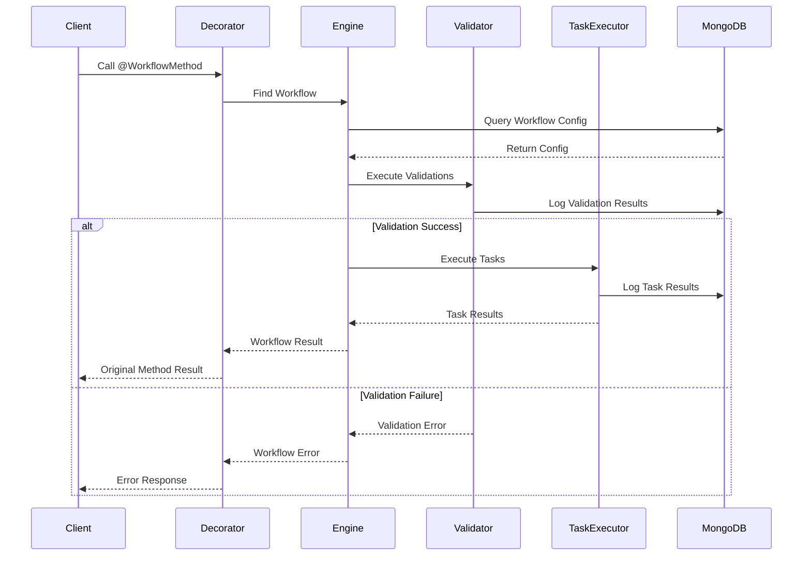

# Workflow Engine Library

A powerful Node.js library for building and executing configurable workflows with validation and task execution capabilities. This library provides a flexible way to intercept method calls, validate inputs, and execute ordered tasks based on configuration.

## Features

- 🔄 **Method Interception**: Automatically intercept and process method calls using decorators
- ✅ **Validation Engine**: Support for multiple validation types with configurable rules
- 🚀 **Task Execution**: Execute ordered tasks (currently API calls, extensible for other types)
- 📊 **MongoDB Integration**: Persistent storage for workflows and execution logs
- 🔁 **Retry Mechanism**: Built-in support for task retries and timeouts
- 📝 **Comprehensive Logging**: Detailed execution logs with MongoDB integration

## Installation

```bash
npm install @your-org/workflow-engine
```

## Quick Start

1. **Decorate your method**:
```typescript
import { WorkflowMethod } from '@your-org/workflow-engine';

class UserService {
    @WorkflowMethod()
    async createUser(userData: any) {
        // Your business logic
    }
}
```

2. **Configure your workflow**:
```json
{
    "id": "user-creation-workflow",
    "name": "User Creation Workflow",
    "trigger": "UserService.createUser",
    "validations": [
        {
            "id": "email-validation",
            "name": "Email Format Check",
            "condition": "data.email.includes('@')",
            "message": "Invalid email format",
            "onFail": "stop"
        }
    ],
    "tasks": [
        {
            "id": "notify-admin",
            "type": "api_call",
            "config": {
                "url": "https://api.example.com/notify",
                "method": "POST",
                "body": {
                    "email": "{{data.email}}"
                }
            }
        }
    ]
}
```

## Detailed Documentation

### 1. Workflow Configuration

#### Basic Structure
```typescript
interface Workflow {
    id: string;
    name: string;
    trigger: string;
    validations: ValidationRule[];
    tasks: Task[];
}
```

#### Trigger Format
- Basic: `ClassName.methodName`
- With Entity: `ClassName.methodName.entityType`

### 2. Validation Rules

#### Types of Validations
1. **Field Conditions**
```json
{
    "id": "age-check",
    "name": "Age Validation",
    "condition": "data.age >= 18",
    "message": "User must be 18 or older",
    "onFail": "stop"
}
```

2. **Regex Matching**
```json
{
    "id": "phone-format",
    "name": "Phone Number Format",
    "condition": "/^\\+?[1-9]\\d{1,14}$/.test(data.phone)",
    "message": "Invalid phone number format",
    "onFail": "stop"
}
```

#### Validation Failure Actions
- `stop`: Halt workflow execution
- `continue`: Proceed despite failure
- `retry`: Attempt validation again
- `fallback`: Execute alternative logic

> **Note**: The validation engine currently evaluates conditions using JavaScript expressions. While the system supports various validation types in its architecture (FIELD_CONDITION, REGEX_MATCH, CUSTOM_FUNCTION, COMPOSITE, EXTERNAL_API), only field conditions and regex matching are fully implemented in the current version. Additional validation types are planned for future releases.

### 3. Task Execution

#### API Task Configuration
```json
{
    "id": "api-task",
    "type": "api_call",
    "config": {
        "url": "https://api.example.com/endpoint",
        "method": "POST",
        "headers": {
            "Authorization": "Bearer {{context.token}}"
        },
        "body": {
            "userId": "{{data.id}}",
            "action": "create"
        },
        "timeout": 5000,
        "retries": 3
    }
}
```

#### Task Context
Tasks have access to:
- Original method input data
- Previous task results
- Workflow context
- Execution metadata

### 4. Logging and Monitoring

#### Log Structure
```typescript
interface WorkflowLog {
    executionId: string;
    workflowId: string;
    workflowName: string;
    status: 'started' | 'completed' | 'failed';
    validationResults: ValidationResult[];
    taskResults: TaskResult[];
    error?: any;
    timestamp: Date;
}
```

#### Querying Logs
```typescript
// Example: Find failed executions
const failedExecutions = await workflowStore.findLogs({
    status: 'failed',
    startDate: new Date('2024-01-01'),
    endDate: new Date()
});
```

## Limitations

1. **Task Types**: Currently limited to API calls
2. **Parallel Execution**: No built-in support for parallel task execution
3. **Validation Security**: Conditions are evaluated using Function constructor
4. **Configuration**: No UI for workflow configuration (script-based only)
5. **Error Recovery**: Limited support for complex error recovery scenarios

## Future Scope

1. **Additional Task Types**
   - Stored Procedure calls
   - Email sending
   - File operations
   - Database operations

2. **Enhanced Features**
   - Parallel task execution
   - Workflow configuration UI
   - Enhanced validation engine
   - Workflow versioning
   - Workflow templates
   - Real-time monitoring dashboard

3. **Security Enhancements**
   - Secure validation condition evaluation
   - Role-based access control
   - Audit trail improvements

## Activity Diagram



## Contributing

[Contributing guidelines to be added]

## License

[License information to be added] 