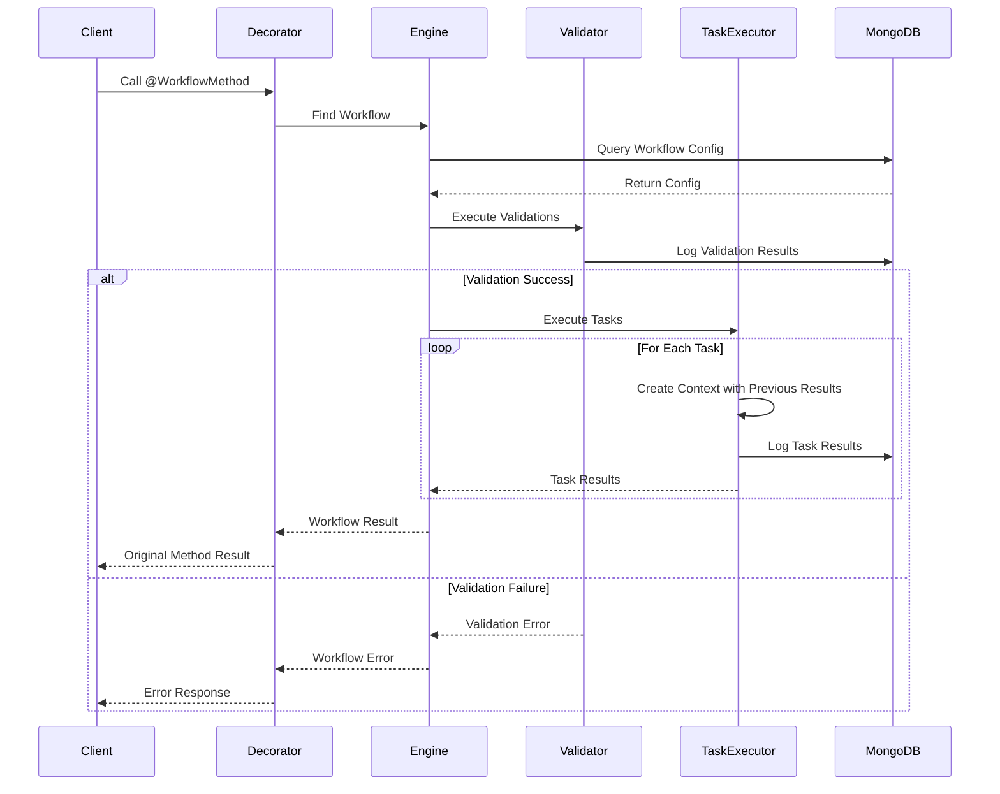
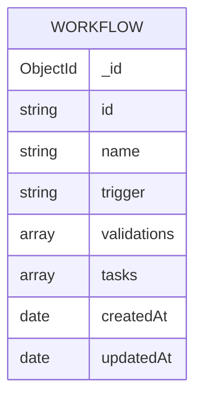
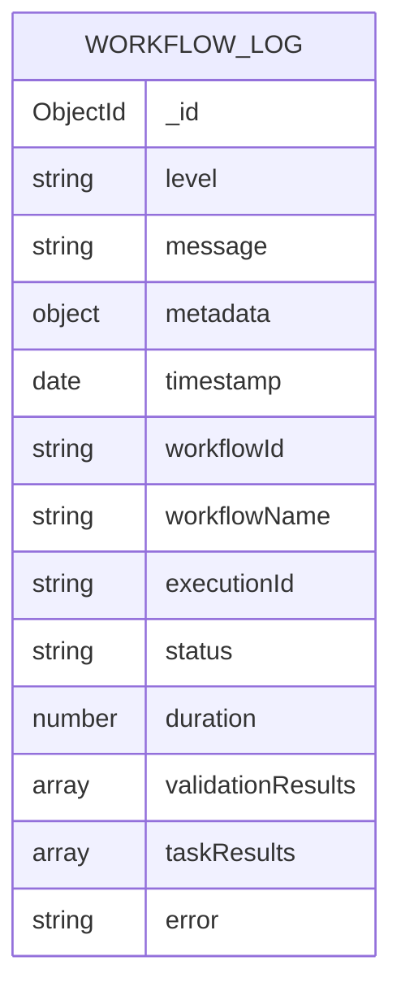

# Catura Decision Engine Library

A powerful Node.js library for building and executing configurable workflows with validation and task execution capabilities. This library provides a flexible way to intercept method calls, validate inputs, and execute ordered tasks based on configuration.

## Features

- 🔄 **Method Interception**: Automatically intercept and process method calls using decorators
- ✅ **Validation Engine**: Support for multiple validation types with configurable rules
- 🚀 **Task Execution**: Execute ordered tasks (currently API calls, extensible for other types)
- 📊 **MongoDB Integration**: Persistent storage for workflows and execution logs
- 🔁 **Retry Mechanism**: Built-in support for task retries and timeouts
- 📝 **Comprehensive Logging**: Detailed execution logs with MongoDB integration

## Installation

```bash
npm install @dynamatix/cat-decision-engine
```

## Quick Start

1. **Decorate your method**:
```typescript
import { WorkflowMethod } from '@dynamatix/cat-decision-engine';

class UserService {
    @WorkflowMethod()
    async createUser(userData: any) {
        // Your business logic
    }
}
```

2. **Configure your workflow**:
```json
{
    "id": "user-creation-workflow",
    "name": "User Creation Workflow",
    "trigger": "UserService.createUser",
    "validations": [
        {
            "id": "email-validation",
            "name": "Email Format Check",
            "condition": "data.email.includes('@')",
            "message": "Invalid email format",
            "onFail": "stop"
        }
    ],
    "tasks": [
        {
            "id": "notify-admin",
            "type": "api_call",
            "config": {
                "url": "https://api.example.com/notify",
                "method": "POST",
                "body": {
                    "email": "{{data.email}}"
                }
            }
        }
    ]
}
```

## Detailed Documentation

### 1. Workflow Configuration

#### Basic Structure
```typescript
interface Workflow {
    id: string;
    name: string;
    trigger: string;
    validations: ValidationRule[];
    tasks: Task[];
}
```

#### Trigger Format
- Basic: `ClassName.methodName`
- With Entity: `ClassName.methodName.entityType`

### 2. Validation Rules

#### Types of Validations
1. **Field Conditions**
```json
{
    "id": "age-check",
    "name": "Age Validation",
    "condition": "data.age >= 18",
    "message": "User must be 18 or older",
    "onFail": "stop"
}
```

2. **Regex Matching**
```json
{
    "id": "phone-format",
    "name": "Phone Number Format",
    "condition": "/^\\+?[1-9]\\d{1,14}$/.test(data.phone)",
    "message": "Invalid phone number format",
    "onFail": "stop"
}
```

#### Validation Failure Actions
- `stop`: Halt workflow execution
- `continue`: Proceed despite failure
- `retry`: Attempt validation again
- `fallback`: Execute alternative logic

> **Note**: The validation engine currently evaluates conditions using JavaScript expressions. While the system supports various validation types in its architecture (FIELD_CONDITION, REGEX_MATCH, CUSTOM_FUNCTION, COMPOSITE, EXTERNAL_API), only field conditions and regex matching are fully implemented in the current version. Additional validation types are planned for future releases.

### 3. Task Execution

#### Task Result Passing
Tasks in a workflow can access results from previous tasks. This is particularly useful for building complex workflows where each task builds upon the results of previous tasks.

```json
{
    "id": "payment-processing-workflow",
    "name": "Payment Processing Workflow",
    "trigger": "PaymentService.processPayment",
    "tasks": [
        {
            "id": "calculatefee",
            "type": "api_call",
            "order": 1,
            "config": {
                "url": "https://api.example.com/calculate-fee",
                "method": "GET"
            }
        },
        {
            "id": "processpayment",
            "type": "api_call",
            "order": 2,
            "config": {
                "url": "https://api.example.com/process-payment",
                "method": "POST",
                "body": {
                    "amount": "{{data.initialAmount}}",
                    "fee": "{{calculatefee.output.data.fee}}",
                    "totalAmount": "{{calculatefee.output.data.fee + data.initialAmount}}"
                }
            }
        }
    ]
}
```

In this example:
- The first task (`calculatefee`) calculates a fee for the payment
- The second task (`processpayment`) uses the fee from the first task to calculate the total amount
- Task results are automatically available in the context using the task ID as the key
- You can access task results using the format `{{taskId.output.data.fieldName}}`

#### API Task Configuration
```json
{
    "id": "api-task",
    "type": "api_call",
    "config": {
        "url": "https://api.example.com/endpoint",
        "method": "POST",
        "headers": {
            "Authorization": "Bearer {{context.token}}"
        },
        "body": {
            "userId": "{{data.id}}",
            "action": "create"
        },
        "timeout": 5000,
        "retries": 3
    }
}
```

#### Task Context
Tasks have access to:
- Original method input data
- Previous task results
- Workflow context
- Execution metadata

### 4. Logging and Monitoring

#### Log Structure
```typescript
interface WorkflowLog {
    executionId: string;
    workflowId: string;
    workflowName: string;
    status: 'started' | 'completed' | 'failed';
    validationResults: ValidationResult[];
    taskResults: TaskResult[];
    error?: any;
    timestamp: Date;
}
```

#### Querying Logs
```typescript
// Example: Find failed executions
const failedExecutions = await workflowStore.findLogs({
    status: 'failed',
    startDate: new Date('2024-01-01'),
    endDate: new Date()
});
```

### 5. Dynamic Forms Integration

The workflow engine can be used to handle dynamic form submissions with different entity types. This is particularly useful for applications that need to process various types of forms (loans, insurance, mortgages, etc.) with different validation rules and workflows.

#### Form Handler Implementation
```typescript
import { WorkflowMethod } from '@your-org/workflow-engine';

export class DynamicFormUseCase {
    constructor(
        private readonly entityType: string // e.g., 'loan', 'insurance', 'mortgage'
    ) { }

    @WorkflowMethod()
    async processForm(data: any) {
        // The decorator will:
        // 1. Get the workflow from MongoDB using the class, method name, and entityType as trigger
        // 2. Execute the workflow (validations and tasks)
        // 3. Only call this method if the workflow succeeds
        return {
            success: true,
            data: {
                ...data,
                entityType: this.entityType,
                status: 'PROCESSED',
                message: `${this.entityType} form processed successfully`
            }
        };
    }
}
```

#### Form Processing Client
```typescript
export async function handleFormSubmission(entityType: string, formData: any) {
    try {
        // Create form handler for the specific entity type
        const formHandler = new DynamicFormUseCase(entityType);

        // Process the form
        const result = await formHandler.processForm(formData);

        return {
            success: true,
            data: result.data
        };
    } catch (error) {
        return {
            success: false,
            error: error instanceof Error ? error.message : 'Unknown error'
        };
    }
}
```

#### Example Form Types
1. **Loan Application**
```typescript
const loanData = {
    applicantName: 'John Doe',
    loanAmount: 50000,
    employmentStatus: 'employed',
    annualIncome: 75000,
    email: 'john.doe@example.com'
};

const result = await handleFormSubmission('loan', loanData);
```

2. **Insurance Application**
```typescript
const insuranceData = {
    policyHolder: 'Jane Smith',
    coverageType: 'health',
    age: 35,
    preExistingConditions: false,
    email: 'jane.smith@example.com'
};

const result = await handleFormSubmission('insurance', insuranceData);
```

3. **Mortgage Application**
```typescript
const mortgageData = {
    propertyValue: 300000,
    downPayment: 60000,
    creditScore: 720,
    employmentHistory: '5 years',
    email: 'mortgage.buyer@example.com'
};

const result = await handleFormSubmission('mortgage', mortgageData);
```

#### Workflow Configuration for Dynamic Forms
```json
{
    "id": "loan-application-workflow",
    "name": "Loan Application Processing",
    "trigger": "DynamicFormUseCase.processForm.loan",
    "validations": [
        {
            "id": "loan-amount",
            "name": "Minimum Loan Amount",
            "condition": "data.loanAmount >= 10000",
            "message": "Loan amount must be at least $10,000",
            "onFail": "stop"
        },
        {
            "id": "income-verification",
            "name": "Income Verification",
            "condition": "data.annualIncome >= 50000",
            "message": "Annual income must be at least $50,000",
            "onFail": "stop"
        }
    ],
    "tasks": [
        {
            "id": "notify-loan-officer",
            "type": "api_call",
            "config": {
                "url": "https://api.example.com/notify-loan-officer",
                "method": "POST",
                "body": {
                    "applicantName": "{{data.applicantName}}",
                    "loanAmount": "{{data.loanAmount}}"
                }
            }
        }
    ]
}
```

> **Note**: The workflow trigger includes the entity type (`DynamicFormUseCase.processForm.loan`), allowing different workflows for different form types.

## Limitations

1. **Task Types**: Currently limited to API calls
2. **Parallel Execution**: No built-in support for parallel task execution
3. **Validation Security**: Conditions are evaluated using Function constructor
4. **Configuration**: No UI for workflow configuration (script-based only)
5. **Error Recovery**: Limited support for complex error recovery scenarios

## Future Scope

1. **Additional Task Types**
   - Stored Procedure calls
   - Email sending
   - File operations
   - Database operations

2. **Enhanced Features**
   - Parallel task execution
   - Workflow configuration UI
   - Enhanced validation engine
   - Workflow versioning
   - Workflow templates
   - Real-time monitoring dashboard

3. **Security Enhancements**
   - Secure validation condition evaluation
   - Role-based access control
   - Audit trail improvements

## Activity Diagram



## Database Schema

### Workflow Collection


### Workflow Logs Collection


### Indexes
- `workflow_logs`: 
  - `{ timestamp: -1 }`
  - `{ workflowId: 1 }`
  - `{ level: 1 }`
  - `{ executionId: 1 }`

